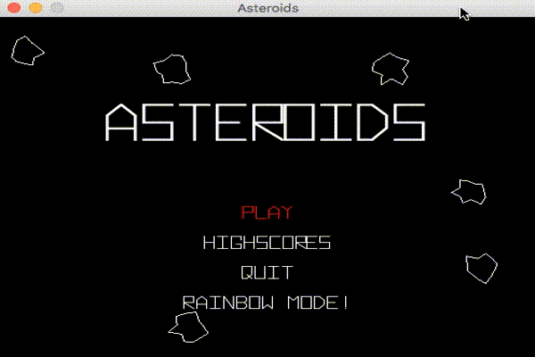

# Games with libGDX

Games using libGDX Library


## Prerequires

1. Git 2.6+
2. Maven 3+
3. Java 8+


## How to Play

Clone

```
git clone https://github.com/humbertodias/games-with-libgdx.git
```

Inside the folder

```
cd games-with-libgdx/src
```

Package

```
mvn -P desktop package
```

Run

```
java -jar desktop/target/asteroids-desktop-1.0-SNAPSHOT-jar-with-dependencies.jar 
```

### Output



## References

[libGDX HOME](https://libgdx.badlogicgames.com/)

[libGDX with Maven](https://github.com/libgdx/libgdx/wiki/Maven-integration)

